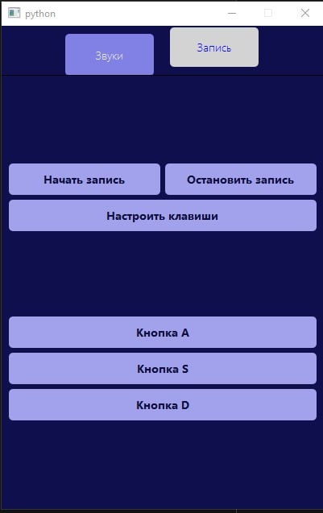
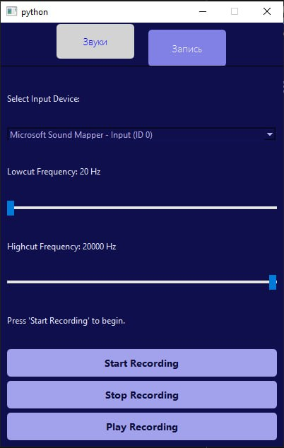
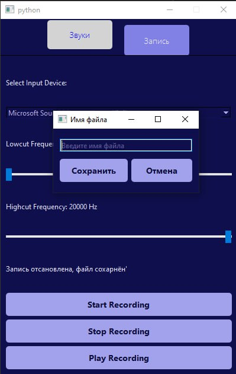
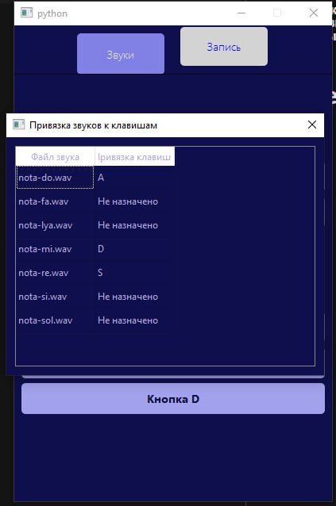

# Melody player

### Приложение для взаимодействия со звуками и звукавыми файлами

# Суть

### Мой проект это программа, в которой вы можете воспроизводить звуки по нажатию на кнопку или клавишу, которую вы забиндили на неё, также вы можете записывать звук с микрофона. А при н-ом количестве звуков/кнопок вы можете сыграть и записать мелодию.

# Особенности

### Мой проект отличается высокой степенью интуитивности: каждая функция работает максимально просто. Достаточно нажать на кнопку, чтобы воспроизвести звук, а если привязать её к определенной клавише, то звук будет играть при каждом нажатии этой клавиши. Переключаясь между вкладками, вы обнаружите окно для записи звука с микрофоном, которое также предельно понятно в использовании. Помимо этого, доступен функционал перебиндинга, который позволит вам настроить управление проектом под ваши индивидуальные предпочтения.

# Скриншоты приложения

# Сторонние библиотеки
| Название    | Версия | Описание                                                                                                                                                                               |
|-------------|--------|----------------------------------------------------------------------------------------------------------------------------------------------------------------------------------------|
| PyQt6       | 6.7.1  | Используется для создания оконного приложения на python                                                                                                                                |
| pygame      | 2.6.1  | В этом коде библиотека pygame используется для воспроизведения звуков. В моём коде pygame.mixer.Sound используется для загрузки звукового файла, который затем можно воспроизвести. |
| sounddevice | 0.5.1  | Используется в этом коде для взаимодействия с аудиоустройствами. Она предоставляет функции для воспроизведения, записи и обработки аудиоданных в реальном времени.                     |
| numpy       | 2.1.3  | Используется для эффективной работы с числовыми массивами, которые представляют аудиоданные.                                                                                           |
| scipy       | 1.14.1 | Используется для обработки входящих аудиоданных во время их записи. Специфически, модуль scipy.signal применяется для создания и применения полосового фильтра к аудиоданным.          |
